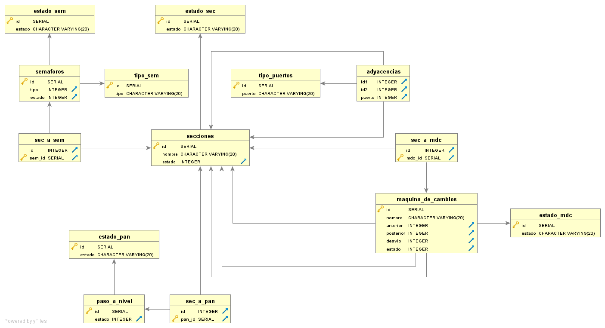
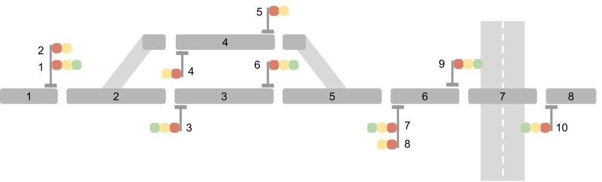

# Arquitectura de datos

- [x] Definir diagrama UML
- [x] Definir tablas
- [x] Crear base de datos (DB)
- [x] Cargas datos en la DB
- [ ] Consultar a la DB
- [ ] Agregar elementos a la DB

# UML

# Topología

# Tablas

## Secciones

| ID | nombre | estado |
| :-: | :-: | :-: |
| 1 | 'T_1'  | 1 |
| 2 | 'T_2'  | 1 |
| 3 | 'T_3'  | 1 |
| 4 | 'T_4'  | 1 |
| 5 | 'T_5'  | 1 |
| 6 | 'T_6'  | 1 |
| 7 | 'T_7'  | 1 |
| 8 | 'T_8'  | 1 |

## SEC_a_MDC
 
| ID | MDC_ID |
| :-: | :-: |
| 2 | 1 |
| 5 | 2 |

## Adyacencias

| ID1 | ID2 | puerto |
| :-: | :-: | :-: |
| 1 | 2 | 2 |
| 2 | 1 | 1 |
| 2 | 3 | 2 |
| 2 | 4 | 3 |
| 3 | 2 | 1 |
| 3 | 5 | 3 |
| 4 | 2 | 1 |
| 4 | 5 | 2 |
| 5 | 3 | 1 |
| 5 | 6 | 2 |
| 6 | 5 | 1 |
| 6 | 7 | 2 |
| 7 | 6 | 1 |
| 7 | 8 | 2 |
| 8 | 7 | 2 |

## SEC_a_SEM

| ID | SEM_ID |
| :-: | :-: |
| 1 | 1 |
| 1 | 2 |
| 3 | 3 |
| 3 | 6 |
| 4 | 4 |
| 4 | 5 |
| 6 | 7 |
| 6 | 8 |
| 6 | 9 |
| 8 | 10 |

## SEC_a_PAN

| ID | PAN_ID |
| :-: | :-: |
| 7 | 1 |

## Maquina_de_cambios

| ID | nombre | anterior | posterior | desvio | estado |
| :-: | :-: | :-: | :-: | :-: | :-: |
| 1 | 'MDC_1'  | 1 | 3 | 4 | 0 |
| 2 | 'MDC_2'  | 3 | 6 | 4 | 0 |

## Semaforos

| ID1 | ID2 | puerto |
| :-: | :-: | :-: |
| 1 | 1 | 0 |
| 2 | 2 | 0 |
| 3 | 1 | 0 |
| 4 | 1 | 0 |
| 5 | 2 | 0 |
| 6 | 2 | 0 |
| 7 | 1 | 0 |
| 8 | 2 | 0 |
| 9 | 2 | 0 |
| 10 | 2 | 0 |

## Paso_a_nivel

| ID | estado |
| :-: | :-: |
| 1 | 0 |

## Estado_SEC

| ID | estado |
| :-: | :-: |
| 0 | 'Ocupado' |
| 1 | 'Libre' |

## Tipo_puertos

| ID | puertos |
| :-: | :-: |
| 1 | 'Anterior' |
| 2 | 'Posterior' |
| 3 | 'Desvio' |

## Estado_MDC

| ID | estado |
| :-: | :-: |
| 0 | 'Normal' |
| 1 | 'Reverso' |

## Tipo_SEM

| ID | tipo |
| :-: | :-: |
| 1 | 'Circulacion' |
| 2 | 'Maniobra' |

## Estado_SEM

| ID | estado |
| :-: | :-: |
| 0 | 'Rojo' |
| 1 | 'Amarillo' |
| 2 | 'Verde' |

## Estado_PAN

| ID | estado |
| :-: | :-: |
| 0 | 'Barrera baja' |
| 1 | 'Barrera alta' |

